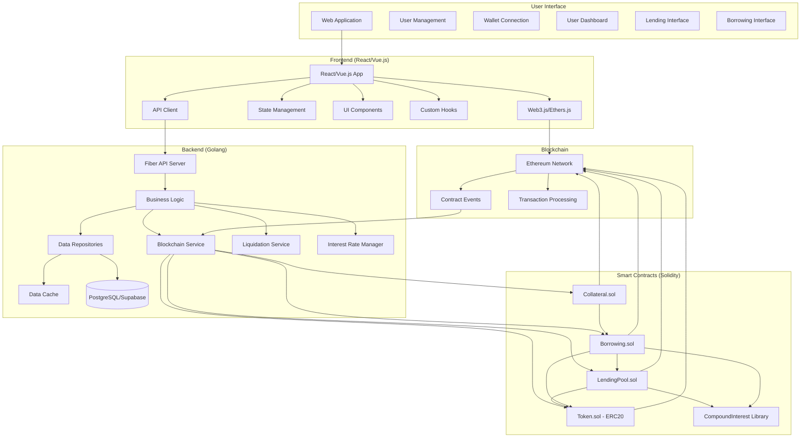

# Decentralized Lending & Borrowing Platform

A comprehensive decentralized finance (DeFi) platform that enables users to lend and borrow digital assets using Ethereum smart contracts. This platform provides a secure, transparent, and efficient way to participate in lending and borrowing activities while earning interest or accessing liquidity.

## Project Architecture



## Project Components

### Smart Contracts (Solidity)

- **Token.sol**: ERC-20 token implementation for the platform's native token.
- **LendingPool.sol**: Manages deposits and lending pools, handles interest calculation for lenders.
- **Borrowing.sol**: Manages borrowing operations, interest rates for borrowers, and repayments.
- **Collateral.sol**: Handles collateral deposits, valuation, and liquidation triggers.
- **Libraries**:
  - **CompoundInterest.sol**: Implementation of compound interest calculations.

### Backend (Golang)

- **Web Server**: Built with Fiber, handles API requests and websocket connections.
- **Business Logic**: Core services for lending, borrowing, collateral management, and liquidations.
- **Blockchain Integration**: Services to interact with deployed smart contracts.
- **Database**: PostgreSQL (via Supabase) for storing transaction history and user data.
- **Monitoring**: Tracks collateral ratios and initiates liquidations when necessary.
- **Security**: Authentication, authorization, and secure blockchain interactions.

### Frontend (React.js or Vue.js)

- **User Interface**: Interactive dashboard for managing lending and borrowing activities.
- **Wallet Integration**: Connect with MetaMask and other Ethereum wallets.
- **Transaction Management**: Monitor and display transaction status.
- **Collateral Dashboard**: Monitor collateral health and liquidation risk.
- **Interest Calculator**: Visualize potential earnings and costs.

## Key Features

- **Supply Lending Pool**: Users can deposit assets to earn interest.
- **Borrowing**: Users can borrow assets by providing collateral.
- **Collateral Management**: Monitor collateral health and manage risk.
- **Dynamic Interest Rates**: Interest rates adjust based on pool utilization.
- **Automatic Liquidations**: Positions below the required collateral ratio are liquidated.
- **User Dashboard**: Track all lending and borrowing activities in one place.

## Technical Stack

- **Smart Contracts**: Solidity, Foundry
- **Backend**: Go, Fiber, GORM, PostgreSQL
- **Frontend**: React.js/Vue.js, Web3.js/Ethers.js
- **DevOps**: Docker, GitHub Actions
- **Testing**: Foundry tests for contracts, Go test for backend

## Getting Started

### Prerequisites

- Go 1.19+
- Node.js 16+
- Docker and Docker Compose
- Foundry (for smart contract development)
- Ethereum wallet (e.g., MetaMask)

### Installation

1. Clone the repository:

   ```bash
   git clone https://github.com/yourusername/defi-lending-platform.git
   cd defi-lending-platform
   ```

2. Install backend dependencies:

   ```bash
   cd backend
   go mod download
   ```

3. Install frontend dependencies:

   ```bash
   cd ../frontend
   npm install
   ```

4. Install smart contract dependencies:
   ```bash
   cd ../contracts
   forge install
   ```

### Configuration

1. Set up environment variables:

   ```bash
   cp backend/.env.example backend/.env
   cp contracts/.env.example contracts/.env
   ```

2. Edit the `.env` files with your specific configurations.

### Running the Project Locally

1. Start the local database:

   ```bash
   cd backend
   docker-compose up -d
   ```

2. Compile and deploy the smart contracts to a local blockchain:

   ```bash
   cd ../contracts
   forge build
   forge script script/Deploy.s.sol --rpc-url localhost:8545 --broadcast
   ```

3. Generate contract bindings for Go:

   ```bash
   cd ../backend
   make generate-bindings
   ```

4. Start the backend server:

   ```bash
   go run cmd/api/main.go
   ```

5. Start the frontend development server:

   ```bash
   cd ../frontend
   npm run dev
   ```

6. Access the application at http://localhost:3000

## Testing

### Smart Contract Tests

```bash
cd contracts
forge test
```

### Backend Tests

```bash
cd backend
go test ./...
```

### Frontend Tests

```bash
cd frontend
npm test
```

## Deployment

### Smart Contracts

1. Deploy to Ethereum testnet (Sepolia):

   ```bash
   cd contracts
   forge script script/Deploy.s.sol --rpc-url $SEPOLIA_RPC_URL --private-key $PRIVATE_KEY --broadcast
   ```

2. Save deployed contract addresses in the backend environment variables.

### Backend

The backend can be deployed using Docker to any cloud provider that supports containers:

```bash
cd backend
docker build -t defi-lending-backend .
docker push yourusername/defi-lending-backend
```

### Frontend

Build and deploy the frontend to your preferred hosting service:

```bash
cd frontend
npm run build
```

## Contributing

1. Fork the repository
2. Create your feature branch: `git checkout -b feature/my-new-feature`
3. Commit your changes: `git commit -am 'Add some feature'`
4. Push to the branch: `git push origin feature/my-new-feature`
5. Submit a pull request

## License

This project is licensed under the MIT License - see the LICENSE file for details.
