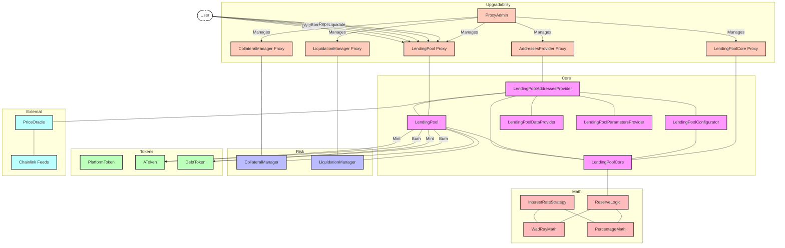
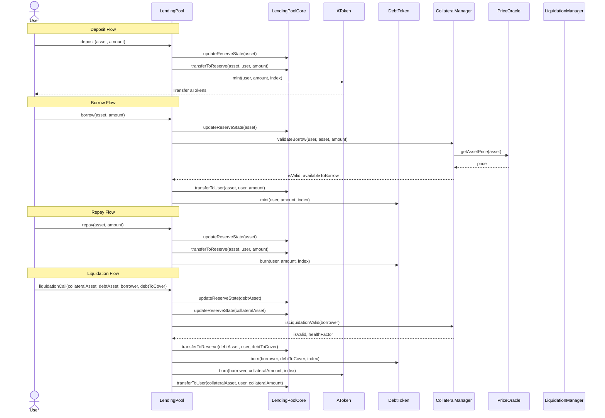

# DeFi Lending & Borrowing Platform

This repository contains the smart contracts for a decentralized lending and borrowing platform built on Ethereum. The platform uses upgradeable contracts to allow for future improvements without losing data.

## Architecture

The platform follows a modular architecture inspired by the AAVE protocol, with clear separation of concerns:

### Contract Architecture Diagram



### Upgradeability Design

The platform uses the UUPS (Universal Upgradeable Proxy Standard) pattern for upgradability:

- **Proxy Contracts**: Delegate calls to implementation contracts while preserving storage
- **Implementation Contracts**: Contain the logic but don't store state variables
- **ProxyAdmin**: Controls proxy upgrades with proper access control
- **Storage Gaps**: Reserved storage slots for future variables to prevent clashes

Key upgradeable contracts:
- **LendingPoolAddressesProvider**
- **LendingPool**
- **LendingPoolCore**
- **CollateralManager**
- **LiquidationManager**

### Core Components

- **LendingPool**: Main entry point for users to interact with the protocol (deposit, borrow, repay, liquidate)
- **LendingPoolCore**: Manages all assets and handles actual transfers
- **LendingPoolAddressesProvider**: Registry for all the addresses used in the protocol
- **LendingPoolConfigurator**: Handles administrative functions and reserve configuration
- **LendingPoolDataProvider**: Provides data about the lending pool state for frontends
- **LendingPoolParametersProvider**: Contains the default parameters for the lending pool

### Tokens

- **PlatformToken**: Governance token for the platform
- **AToken**: Interest-bearing token that represents a user's deposit
- **DebtToken**: Token that represents a user's debt

### Risk Management

- **CollateralManager**: Manages collateral requirements and health factors
- **LiquidationManager**: Handles liquidations of undercollateralized positions

### Pricing

- **PriceOracle**: Uses Chainlink price feeds to provide asset prices

### Mathematical Components

- **InterestRateStrategy**: Implements interest rate models based on utilization rates
- **WadRayMath**: Library for fixed-point math operations
- **PercentageMath**: Library for percentage calculations
- **ReserveLogic**: Library for reserve operations logic

## Operation Flow

The following diagram illustrates the interaction flow between different contracts during key operations:



## Interest Rate Model

The platform uses a dynamic interest rate model based on the utilization rate (U) of each asset pool:

```
r(U) = r_min + (r_max - r_min) × U^β
```

Where:
- r_min: Minimum interest rate when utilization is 0
- r_max: Maximum interest rate when utilization is 100%
- U: Utilization rate (borrowed amount / total liquidity)
- β: Elasticity factor (controls how quickly rates increase with utilization)

## Collateralization & Liquidations

Each asset has specific parameters:
- **LTV (Loan-to-Value)**: Maximum percentage of collateral that can be borrowed
- **Liquidation Threshold**: Percentage of collateral at which liquidation becomes possible
- **Liquidation Bonus**: Bonus percentage for liquidators

A user's position is measured by a Health Factor:
```
Health Factor = (Collateral Value × Liquidation Threshold) / Total Borrowed
```

When the Health Factor falls below 1, the position can be liquidated. Liquidators repay a portion of the debt and receive a corresponding amount of collateral plus a bonus.

## How to Use

### Prerequisites

- [Foundry](https://getfoundry.sh/)
- Solidity 0.8.29

### Install Dependencies

```bash
# Navigate to the project directory
cd /Users/vincent/Documents/5ESGI/Defi/Lending-Borrowing/contracts

# Install OpenZeppelin contracts
forge install OpenZeppelin/openzeppelin-contracts@v5.0.1 --no-commit

# Install OpenZeppelin's Upgradeable Contracts
forge install OpenZeppelin/openzeppelin-contracts-upgradeable@v5.0.1 --no-commit

# Install Chainlink contracts
forge install smartcontractkit/chainlink-brownie-contracts@1.2.0 --no-commit

# Install Forge Standard Library
forge install foundry-rs/forge-std --no-commit
```

### Compile Contracts

```bash
forge build
```

### Run Tests

```bash
forge test
```

### Deploy

```bash
# Make sure to source your .env file with required environment variables
source .env

# Deploy using the script
forge script script/Deploy.sol:Deploy --rpc-url $ETH_RPC_URL --private-key $PRIVATE_KEY --broadcast
```

### Upgrading Contracts

To upgrade a contract:

1. Deploy a new implementation
2. Call `upgrade()` on the ProxyAdmin with the proxy address and the new implementation address

Example:
```bash
# Deploy new implementation
forge create src/core/LendingPool.sol:LendingPool --rpc-url $ETH_RPC_URL --private-key $PRIVATE_KEY

# Create a script to upgrade the proxy
forge script script/UpgradeLendingPool.sol:UpgradeLendingPool --rpc-url $ETH_RPC_URL --private-key $PRIVATE_KEY --broadcast
```

## License

MIT
